# HTA negotiation serious game

This repository contains the teaching materials and results workflow for a
classroom negotiation game about a financial agreement for an expensive drug.
Students represent either a **Healthcare Payer (HCP)** or a **Health Technology
Developer (HTD)**. They negotiate for three rounds, submit each agreement
through a Google Form, receive new information between rounds, and discuss the
calculated results at the end.

The repository is the source of truth for the presentations, news flashes, and
R-based scoring. The Google Form and Google Sheet are external dependencies.
It also contains a first Shiny prototype intended to replace this workflow over
time; the existing Form/Quarto flow remains the production version for now.

Future maintainers and AI agents should begin with [`AGENTS.md`](AGENTS.md) for
working rules and [`_MAP.md`](_MAP.md) for the architecture and change history.

## Shiny prototype

The Shiny prototype implements a low-traffic classroom interaction:

- students join by tutor, negotiation group, and HCP/HTD role;
- staff unlock a protected control area with a PIN;
- students continue to each round themselves after a verbal cue from their
  tutor; their navigation does not read PostgreSQL;
- staff explicitly start a fresh game for the selected tutor, clearing that
  tutor's prior data and recording Round 1's start time; the forward-only
  control then records later round timestamps without changing student screens;
- the staff area includes a browser-local stopwatch with start, stop, reset,
  and an optional beep at a chosen elapsed minute;
- confidential information is rendered only for the intended role;
- one player submits an agreement for a negotiation group and round after a
  confirmation step; every submission is retained with a server-side
  timestamp, and the latest on-time one is scored;
- Round 3 hospital production is an optional HCP-only decision and is not
  displayed to the HTD role;
- the staff area has no live data dashboard or database polling;
- tutors can open a static introduction deck and create a fixed closing-results
  snapshot from the staff area;
- the player and staff views switch instantly between English and Dutch;
- light and dark modes share one ESHPM-inspired visual system; and
- presentation links inherit the active language and theme.

Tutor names, group labels, round information, and scenario values are defined
in [`config.R`](config.R). Without a database connection the app uses an
in-memory store, so submissions and tutor timestamps disappear when the app
stops. When `DATABASE_URL` is configured, the PostgreSQL backend in
[`R/storage.R`](R/storage.R) is selected automatically and persists the
append-only submission log. The legacy Google Form/Sheet workflow is unchanged.

Run the prototype from the repository root:

```r
Sys.setenv(STAFF_PIN = "choose-a-local-test-pin")
shiny::runApp()
```

If `STAFF_PIN` is not set, the local prototype uses `demo` and displays a
warning. Never deploy it with that fallback PIN.

### Neon PostgreSQL setup

PostgreSQL is the online backend for durable submissions and tutor timestamps.
The app makes no database connection on ordinary page loads, joining, student
round navigation, or timer updates. It creates the new `hta_game_submission_log`,
`hta_game_round_events`, and `hta_game_presentations` tables lazily on the
first write. This may make that first write slower; tutors should click the
round-start control before students submit. Install the two database packages
once:

```r
install.packages(c("DBI", "RPostgres"))
```

This repository is linked locally to Neon with its CLI. `neon link` writes the
workspace context to `.neon` and the Neon variables to `.env.local`; both are
ignored by Git. For local R use, pull only the PostgreSQL variables into the
equally ignored `.Renviron` file:

```sh
npx neon@latest link --project-id YOUR_PROJECT_ID -y
npx neon@latest env pull --file .Renviron --service postgres
```

Neon supplies a pooled `DATABASE_URL` and direct `DATABASE_URL_UNPOOLED`.
This RPostgres app uses the direct URL for both submissions and schema setup.
Repeated parameterized submissions failed intermittently through the pooled
endpoint during testing; this low-traffic classroom app opens a short-lived
direct connection per database action. Keep both variables configured because
`DATABASE_URL` still selects PostgreSQL mode automatically. A pooled-only Neon
configuration now reports a setup error instead of saving unreliably.
No Neon Auth, Data API, Object Storage, Functions, or AI Gateway service is
needed by this version of the app.

Set a staff PIN separately and start the app from the repository root:

```r
Sys.setenv(
  STAFF_PIN = "choose-a-long-staff-pin"
)
shiny::runApp()
```

Set `GAME_STORAGE_MODE=memory` to override the automatic selection for an
isolated local test. The backend also accepts `PGHOST`, `PGDATABASE`, `PGUSER`,
`PGPASSWORD`, and optionally `PGPORT`/`PGSSLMODE` instead of `DATABASE_URL`.
The game does **not** reset automatically. Before each new class, staff select
their tutor and click **Start new game for this tutor**. After confirmation,
this deletes that tutor's submissions and round timestamps in the configured
`session_id`, records the start of Round 1, and revokes older results links
(which include data from all tutors). Other tutors' submissions and timestamps
remain. Players should reload and join again; browsers already in a round are
not moved or cleared remotely. Use the next-round button for Round 2, Round 3,
and game end. Do not start a new game after students begin submitting unless
you intentionally want to discard that tutor's current data.

Change `session_id` in `config.R` when you need separate historical classroom
runs; it separates one session's submissions and timestamps from another. The
former live-state tables are not migrated or deleted automatically.

### Developer database access and backups

With the same `DATABASE_URL_UNPOOLED` (or direct `DATABASE_URL`) used by the
app, run this separate script from the repository root. It does not start
Shiny or modify the legacy Google Sheet:

```sh
Rscript scripts/game_db_admin.R status
Rscript scripts/game_db_admin.R export hta-demo /absolute/path/to/new-backup-folder
```

`status` lists row counts by session and tutor. `export` writes all three game
tables as CSV, including full submissions. Choose an export location outside
the repository and keep it private. To delete data, first stop classroom play;
the reset commands create a new CSV backup directory **before** deleting rows:

```sh
Rscript scripts/game_db_admin.R reset-session hta-demo /absolute/path/to/new-backup-folder CONFIRM:hta-demo
Rscript scripts/game_db_admin.R reset-all /absolute/path/to/new-backup-folder CONFIRM:ALL-GAME-DATA
```

`reset-session` affects every tutor in one session. `reset-all` affects all
sessions in the three `hta_game_*` tables, but does not drop the tables or
touch any other tables in Neon. Both invalidate affected results links. These
commands are never run automatically. The app's staff button is narrower:
it resets only the selected tutor (and revokes results links).

Do not commit a connection URL or staff PIN. The local Neon connection does not
automatically transfer its credentials to Connect Cloud: configure them as
encrypted content variables and complete a concurrent multi-browser rehearsal.
Credentials must be handled deliberately rather than added to `config.R`.

### Free online deployment

The Shiny prototype is prepared for the free Posit Connect Cloud plan. The plan
requires a public GitHub repository. The tracked [`manifest.json`](manifest.json)
contains an explicit deployment allowlist: `app.R`, `config.R`, `R/`, and
`www/`. Legacy calculations, source presentations, tests, agent files, and local
environment files remain in the repository but are not included in the running
application image.

The current public deployment is available at
[serious-game on Connect Cloud](https://01a047fd-8fd8-c973-b4f6-9dfe923afd7f.share.connect.posit.cloud/).
It was verified on 28 August 2026 with R 4.6.0 and the Neon PostgreSQL backend.

To publish:

1. Sign in to [Posit Connect Cloud](https://connect.posit.cloud/) and choose
   **Publish → Shiny**.
2. Connect the GitHub repository, select the `main` branch, and choose `app.R`
   as the primary file.
3. Add `DATABASE_URL`, `DATABASE_URL_UNPOOLED`, and a non-demo `STAFF_PIN` as
   content variables. Do not add `GAME_STORAGE_MODE`; the configured database
   URL selects PostgreSQL automatically.
4. Publish and open the generated public URL.
5. Before classroom use, rehearse with separate HCP, HTD, and facilitator
   browsers. Then use **Start new game for this tutor** for each tutor that
   took part in testing, before players join the real session.

Connect Cloud currently supports R through 4.6.0, so the manifest is pinned to
that version even when generated locally with a newer patch release. If the
manifest is regenerated, retain a platform version supported by Connect Cloud
and confirm that `shiny`, `DBI`, and `RPostgres` remain listed.

### Language, theme, and visual design

The EN/NL and light/dark controls are in the shared app header, so they remain
available when moving between the player and facilitator views. The selection
applies to the current browser session. A presentation opened from the Staff
area receives the same language and theme through its URL.

Interface copy is stored in [`R/i18n.R`](R/i18n.R); scenario-specific round
titles, shared facts, and confidential news are bilingual entries in
[`config.R`](config.R). Add new interface text to both dictionaries and keep
both language versions of scenario content together when editing a round.

The visual system takes its core palette and typography cues from the
[ESHPM website](https://www.eur.nl/en/eshpm): deep green, purple, warm neutral
surfaces, clear type hierarchy, and compact controls. Animated rainbow frames
highlight only important cards and presentation moments. Motion is disabled
automatically when a browser requests reduced motion.

### Facilitator presentations

The Staff area contains two presentation controls:

- **Open introduction presentation** opens the bundled English or Dutch static
  Reveal.js deck. It is available before anyone joins and does not depend on
  live game data.
- **Create results presentation** writes a snapshot cutoff and gives the tutor
  a link. Opening the link performs one on-demand batch read of the submission
  log and tutor round timestamps. The deck includes a timing audit, reflection
  questions, overspending, crowding-out, untreated patients, average prices,
  and HCP/HTD points.

The closing deck opens in a new browser tab. Navigate with its buttons, arrow
keys, Page Up/Page Down, or the space bar. It is fixed at the cutoff recorded
when its link was created. To include a later correction, create a new link.
Opening or reloading a deck link fetches that same cutoff's data once; slide
navigation makes no database requests.

The editable opening sources are
[`presentations/before_game.qmd`](presentations/before_game.qmd) and
[`presentations/before_game_nl.qmd`](presentations/before_game_nl.qmd). After
changing them, rebuild both files bundled with Shiny by running this from
`presentations/`:

```sh
quarto render before_game.qmd \
  --output opening-presentation-en.html \
  --output-dir ../www

quarto render before_game_nl.qmd \
  --output opening-presentation-nl.html \
  --output-dir ../www
```

The closing deck is part of `app.R`; it does not render or read the legacy
`presentations/after_game.qmd` workflow.

### Tutor controls and timer

The round control is intentionally tutor-level: select a tutor and use **Next
round for all your groups** to record the start of rounds 1–3, then the game-end
timestamp. The control does not move any student screen. After the tutor's
verbal cue, students select **Continue to Round …** in their own browser. There
is no live round synchronization or backward tutor control. A tutor who
refreshes the page should coordinate with colleagues before clicking again:
the next click records that tutor's next unrecorded event in the database.
There is no minimum waiting time between clicks, including during a rehearsal.
After Round 1, Round 2, Round 3, and game end have all been recorded, further
clicks cannot create another round marker for that tutor.

The timestamp for the next round closes the previous round. Round 3 ends at
the recorded game-end timestamp, or when a presentation link is created if
game end was not recorded. The database clock supplies timestamps; the latest
submission within each round's window is scored. A submitted correction outside
the window remains in the log but is not scored. Missing round markers are
flagged in the presentation audit rather than silently treated as verified.

The staff stopwatch runs locally in each tutor's browser and does not write to
PostgreSQL. **Start timer** begins or pauses elapsed time, while **Reset timer**
returns it to `00:00`. Tutors can enable **Play beep at** and choose an elapsed
minute. Browser audio is initialized by the tutor's button click; volume still
depends on the computer and classroom sound settings.

Run its automated checks with:

```sh
Rscript tests/testthat.R
```

## Workflow at a glance

```mermaid
flowchart LR
    A["Opening presentation<br>and role assignment"] --> B["Round 1<br>baseline negotiation"]
    B --> C["Submit agreement<br>through Google Form"]
    C --> D["Round 2<br>confidential HTD news"]
    D --> E["Submit agreement<br>through Google Form"]
    E --> F["Round 3<br>confidential HCP news"]
    F --> G["Submit agreement<br>through Google Form"]
    G --> H["Google Sheet<br>responses + settings"]
    H --> I["R calculations"]
    I --> J["Results presentation<br>and debrief"]
```



Each working group contains an HCP team and an HTD team. In every round they
may agree on up to three patient tiers, each with a number of patients and a
price per patient. A round normally consists of 10 minutes of preparation and
10 minutes of negotiation. The agreement is valid for one year.

| Stage | Information/action | Material |
|---|---|---|
| Start | Explain the scenario, roles, rules, and scoring | [`presentations/before_game.qmd`](presentations/before_game.qmd) |
| Round 1 | Negotiate using the baseline scenario | Opening presentation |
| After round 1 | Submit the agreed patient numbers and prices | [Google Form](https://bit.ly/serious-game-result) |
| Round 2 | Give the confidential QALY update to **HTD only**, then negotiate again | [`news_flashes/htd.qmd`](news_flashes/htd.qmd) / [published version](https://fthielen.quarto.pub/round2-br-confidential-information-for-htd-qaly-adjustment-for-rcmd-treatment-a389/) |
| After round 2 | Submit the new agreement | [Google Form](https://bit.ly/serious-game-result) |
| Round 3 | Give the confidential budget/QALY update to **HCP only**, then negotiate again | [`news_flashes/hcp.qmd`](news_flashes/hcp.qmd) / [published version](https://fthielen.quarto.pub/round3-br-confidential-information-for-hcp-budget-and-qaly-adjustment-for-rcmd-treatment-b910/) |
| After round 3 | Submit the final agreement | [Google Form](https://bit.ly/serious-game-result) |
| Debrief | Refresh the calculations, render the results, and discuss outcomes | [`presentations/after_game.qmd`](presentations/after_game.qmd) |

The current published opening and results presentations are available at
[before_game](https://fthielen.quarto.pub/before_game/) and
[after_game](https://fthielen.quarto.pub/after_game/).

## Repository structure

```text
.
├── README.md
├── app.R                       # First interactive Shiny prototype
├── config.R                    # Tutors, groups, news, and scenario settings
├── calculations.R              # Current Form-based results workflow
├── R/
│   ├── i18n.R                  # English and Dutch interface copy
│   ├── scoring.R               # Pure scoring functions used by Shiny
│   └── storage.R               # Replaceable prototype state store
├── tests/testthat/              # Scoring and state-store checks
├── www/
│   ├── styles.css               # Shiny interface styling
│   ├── app.js                   # Applies language/theme preferences
│   ├── eshpm-logo.png           # Shared ESHPM logo
│   ├── opening-presentation-*.html # Bundled EN/NL introduction decks
│   └── presentation.*           # Live closing-deck styling and controls
├── news_flashes/
│   ├── htd.qmd                 # Confidential information for HTD before round 2
│   ├── hcp.qmd                 # Confidential information for HCP before round 3
│   └── _publish.yml            # Quarto Pub destinations
└── presentations/
    ├── before_game.qmd         # Opening Reveal.js presentation
    ├── before_game_nl.qmd      # Dutch opening Reveal.js presentation
    ├── after_game.qmd          # Data-driven results presentation
    ├── logo.css                # Presentation styling
    ├── theme-init.html         # Applies the selected presentation theme
    └── _publish.yml            # Quarto Pub destinations
```

The `.qmd` files are the editable presentation sources. Generated outputs may
lag behind their source, so edit and render the corresponding `.qmd` file rather
than changing generated files directly.

## Google Form and Sheet contract

The Google Form writes to the spreadsheet configured by `g_sheet` in
[`calculations.R`](calculations.R). The script reads two tabs:

- `Form responses 1`: one row per team submission;
- `settings`: scenario and scoring inputs for each round.

The response import currently relies on **column position**, not the Form's
question labels. It expects this exact order:

```text
time, wg, gr,
r1n1, r1p1, r1n2, r1p2, r1n3, r1p3,
r2n1, r2p1, r2n2, r2p2, r2n3, r2p3,
r3n1, r3p1, r3n2, r3p2, r3n3, r3p3
```

Here, `wg` is the working-group number, `gr` identifies the negotiating
subgroup, and each `n`/`p` pair is the number of patients and price per patient
for a tier in a given round. Reordering, adding, or removing Form questions can
therefore break the import or silently assign the wrong meaning to a column.

The `settings` tab must contain one row per round and the columns used by the
calculation:

| Column | Meaning |
|---|---|
| `round` | Round number used to join settings to responses |
| `n_pats` | Total eligible patients |
| `qaly_yr` | QALYs gained per treated patient per year |
| `gov_max_budget` | HCP budget for the treatment |
| `wtp` | Cost per QALY used for crowding-out |
| `list_price` | Drug list price per patient |
| `sales_expect` | HTD sales-expectation factor used in scoring |

Keep these settings consistent with the opening presentation and confidential
news flashes whenever the scenario changes.

## Scoring and results

[`calculations.R`](calculations.R) filters responses from `game_date` onward,
reshapes the three rounds, joins the round settings, and calculates:

- patients treated and untreated;
- total budget impact and remaining/overspent HCP budget;
- QALYs gained and QALYs lost through crowding-out;
- HTD sales;
- a 0–10 HCP score based on QALYs (60%) and population treated (40%);
- a 0–10 HTD score based on sales (60%) and sales expectations (40%).

In round 3, the current calculation treats tier 1 as hospital production and
therefore excludes it from HTD sales. The results presentation reports budget
overspending, crowding-out, untreated patients, average price per patient, and
both parties' points by round.

## Preparing a session

1. Confirm that the opening presentation and both confidential news flashes
   describe the intended scenario.
2. Check the Google Form question order against the response schema above and
   submit a test response.
3. Check all three rows in the Sheet's `settings` tab against the teaching
   materials.
4. Change `game_date` near the top of [`calculations.R`](calculations.R) to the
   session date. Only responses at or after this date are included.
5. Authenticate `googlesheets4` with an account that can read the Sheet.
6. Render and check the opening presentation and news flashes.
7. Verify that the short links shown to students still point to the intended
   Form and news flashes.

The Google account is named in the R scripts, but credentials and OAuth tokens
must remain outside this repository.

## Software setup

Install [R](https://www.r-project.org/) and
[Quarto](https://quarto.org/docs/get-started/), then install the required R
packages:

```r
install.packages(c(
  "googlesheets4",
  "here",
  "kableExtra",
  "knitr",
  "lubridate",
  "shiny",
  "testthat",
  "tidyverse"
))
```

Open `serious-game.Rproj`, or run commands from the repository root so that
`here::here("calculations.R")` resolves correctly. Authenticate once in an
interactive R session:

```r
googlesheets4::gs4_auth(email = "eshpm.serious.game@gmail.com")
```

Render the materials with:

```sh
quarto render presentations/before_game.qmd
quarto render presentations/before_game_nl.qmd
quarto render news_flashes/htd.qmd
quarto render news_flashes/hcp.qmd
quarto render presentations/after_game.qmd
```

The final command reads the live Sheet and rebuilds the results presentation,
so run it only after checking `game_date`, the Sheet settings, and the submitted
responses. Rendering it requires network access and valid Google authorization.

To update an existing Quarto Pub deployment, use the publication configuration
stored in each folder, for example:

```sh
quarto publish quarto-pub presentations/before_game.qmd
quarto publish quarto-pub presentations/after_game.qmd
quarto publish quarto-pub news_flashes/htd.qmd
quarto publish quarto-pub news_flashes/hcp.qmd
```

Publishing changes the student-facing material, so preview the rendered files
locally before publishing.

## End-of-session workflow

1. Confirm that every working group submitted all three rounds and that no test
   rows fall within the active date filter.
2. Render `presentations/after_game.qmd` from the repository root. Its setup
   chunk sources `calculations.R`, reads the Google Sheet, and calculates the
   results automatically.
3. Open `presentations/after_game.html`, check all result tables for missing or
   implausible values, and use it for the class debrief.
4. Publish the results only if a public student-facing copy is intended.

## Current maintenance notes

- The spreadsheet ID, Google account, tab names, and session date are hard-coded
  in the current Form-based R files.
- There is no dependency lockfile or automated test for the Form/Sheet schema.
- Form responses are filtered by date rather than by a dedicated session ID.
- The online Shiny prototype persists live state in Neon PostgreSQL. A complete
  concurrent classroom rehearsal and recovery test are still outstanding.

These are useful starting points for the next round of project improvements.
