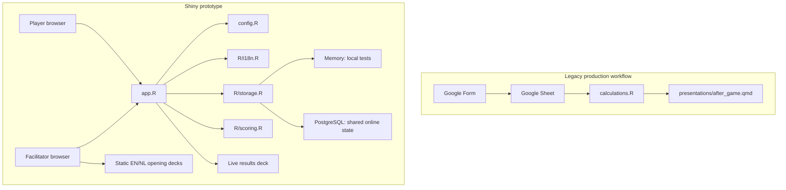

# Project map and implementation history

Last updated: 2026-08-28

This document gives future maintainers and AI agents a compact map of the
repository, records the work already completed, and separates current behavior
from proposed future work. For operational rules, read [`AGENTS.md`](AGENTS.md).

## 1. Current project state

The project began as a Google Form/Sheet workflow and now also contains a Shiny
prototype. The prototype has memory and PostgreSQL storage implementations and
is linked locally to a Neon PostgreSQL project. It is not yet ready for a public
classroom deployment because shinyapps.io secret delivery and the concurrent
classroom test are not yet configured.



## 2. Repository map

```text
.
├── AGENTS.md                    # Rules for future AI/coding agents
├── _MAP.md                      # This architecture and history document
├── README.md                    # Human setup and operational guide
├── app.R                        # Shiny UI, server, staff view, live results deck
├── config.R                     # Tutors, groups, roles, rounds, scenario values
├── calculations.R               # Legacy Google Sheet calculation
├── eshpm-logo.png               # User-supplied source logo image
├── R/
│   ├── i18n.R                  # English and Dutch interface translations
│   ├── scoring.R               # Pure scoring functions for Shiny
│   └── storage.R               # Store contract, memory, and PostgreSQL backends
├── tests/
│   ├── testthat.R
│   └── testthat/
│       ├── test-scoring.R
│       └── test-storage.R
├── www/
│   ├── app.js                   # Applies language/theme to the document
│   ├── eshpm-logo.png           # PNG logo served by Shiny
│   ├── styles.css               # App visual system
│   ├── presentation.css         # Live closing-deck visual system
│   ├── presentation.js          # Live closing-deck navigation
│   ├── opening-presentation-en.html
│   └── opening-presentation-nl.html
├── presentations/
│   ├── before_game.qmd          # English static introduction source
│   ├── before_game_nl.qmd       # Dutch static introduction source
│   ├── before_game.html         # Rendered English standalone deck
│   ├── after_game.qmd           # Legacy data-driven closing source
│   ├── after_game.html          # Legacy rendered result
│   ├── logo.css                 # Static Reveal.js styling
│   ├── theme-init.html          # Query-driven presentation theme setup
│   └── _publish.yml             # Quarto Pub configuration
└── news_flashes/
    ├── htd.qmd                  # Legacy confidential HTD news
    ├── hcp.qmd                  # Legacy confidential HCP news
    └── _publish.yml
```

## 3. Shiny runtime flow

### Player flow

1. Select language and light/dark theme.
2. Select tutor, negotiation group, and assigned HCP/HTD role.
3. Join without entering a name or other personal identifier.
4. Wait in the lobby until staff advances the group.
5. Receive the shared round facts.
6. Receive confidential news only when it belongs to the selected role.
7. Enter up to three patient/price tiers. In Round 3, the HCP may separately
   choose optional hospital production; the HTD never sees this control.
8. Review a confirmation and submit for the complete tutor/group/round; a later
   submission replaces the earlier one. Round 3 submission is HCP-only.
9. After the last round, see the group results.

### Facilitator flow

1. Open the Staff view and enter `STAFF_PIN`.
2. Open the static introduction deck in the active language and theme.
3. Start selected lobby groups or advance active groups forward/backward.
4. Monitor group status, connected role sessions, submissions, and calculated
   results.
5. After checking agreements, publish/open the live results presentation.
6. Reset prototype state after testing or at the end of a local session.

### State model

- **Players:** `player_id`, `tutor`, `group`, `role`, `joined_at`.
- **Group state:** `tutor`, `group`, `current_round`, `status`, `updated_at`.
- **Agreements:** tutor/group/round, three patient/price pairs, `updated_at`.
- **Results publication:** one Boolean in the current store.

The memory store creates every configured tutor/group combination and loses all
state when the R process stops. The PostgreSQL store creates the same state in
`hta_game_*` tables, scopes it by `session_id`, and polls revisions so separate
Shiny processes and browsers see each other's changes.

## 4. Presentation map

### Opening presentation

- Static and independent of live results.
- English source: `presentations/before_game.qmd`.
- Dutch source: `presentations/before_game_nl.qmd`.
- Bundled outputs live in `www/` and are opened from the staff panel.
- The theme query parameter is read by `presentations/theme-init.html`.
- Current structure: nine slides covering the challenge, roles, agreement
  format, round progression, timing, scoring, confidentiality, and start cue.

### Shiny live closing presentation

- Implemented by `results_presentation_ui()` in `app.R`.
- Opened using `?view=results&lang=<en|nl>&theme=<light|dark>`.
- Uses live Shiny results and remains updated while the process is running.
- Contains reflection prompts, five result views, and a closing discussion.

### Legacy closing presentation

- Source: `presentations/after_game.qmd`.
- Its setup chunk calls `source(here::here("calculations.R"))`.
- Therefore the correct legacy end-of-session action is to render
  `presentations/after_game.qmd`, not to run `calculations.R` separately.
- It reads the live Google Sheet and needs Google authorization.

## 5. Work completed

### Phase A — repository cleanup and documentation

- Audited the inherited repository and distinguished active source files from
  generated or older material.
- Rewrote `README.md` to explain the teaching scenario, Form/Sheet contract,
  calculation inputs, presentation sources, session preparation, and the
  correct end-of-session workflow.
- Corrected the workflow documentation to state that rendering
  `presentations/after_game.qmd` runs `calculations.R` through its setup chunk.
- Reviewed redundant-file candidates without deleting user material blindly.

### Phase B — Shiny architecture discussion

- Chose a staged migration rather than requiring PostgreSQL immediately.
- Kept classroom configuration in an R file for the first version.
- Identified tutors and group counts as variable configuration.
- Defined a staff-only control area and role-aware player view.
- Agreed that the opening presentation should be static and the closing
  presentation should be generated from current results.

### Phase C — first Shiny prototype

- Added `app.R`, `config.R`, `R/storage.R`, and `R/scoring.R`.
- Added tutor/group/role joining, lobby behavior, and global or selected round
  advancement.
- Added role-based confidential information for rounds 2 and 3.
- Added three-tier group agreement entry and replacement semantics.
- Added round-3 hospital-production validation: tier 1 has a 150-patient
  capacity and EUR 40,000 price when used.
- Added a PIN-protected staff dashboard with state, sessions, agreements, and
  calculated results.
- Added a staff button for the static introduction and a button that publishes
  the live closing deck.
- Added memory-store and scoring tests.

### Phase D — ESHPM visual redesign

- Reviewed the ESHPM website and adopted a deep-green, purple, warm-neutral,
  and white visual system.
- Rebuilt the app layout with a shared brand header, clearer player/staff
  navigation, cards, responsive behavior, and projector-friendly hierarchy.
- Added restrained animated conic-gradient/rainbow frames and floating accents.
- Added reduced-motion handling.
- Redesigned the live closing presentation and its keyboard/button navigation.

### Phase E — bilingual and theme support

- Added `R/i18n.R` with matched English and Dutch dictionaries.
- Localized role names, interface copy, round titles, public summaries,
  confidential news, staff tables, formatting, and closing-deck content.
- Added EN/NL controls shared by player and staff views.
- Added light/dark mode and propagated language/theme into presentation URLs.
- Added `www/app.js` and `presentations/theme-init.html` for document-level
  language and theme application.
- Added and rendered a Dutch static opening deck.

### Phase F — presentation improvement

- Reframed the introduction as a nine-slide facilitator story rather than a
  dense inventory of rules.
- Added a consistent Reveal.js visual system, clearer titles, role comparison,
  round progression, timing callout, scoring explanation, and confidentiality
  guidance.
- Redesigned the live result deck around reflection, five focused result
  screens, and a final strategy discussion.
- Inspected every opening and closing slide in the browser and fixed heading
  semantics, contrast, table colors, and title wrapping.

### Phase G — group-only identity and supplied logo

- Removed the nickname/display-name field from the UI and from the player and
  agreement schemas.
- Staff now sees tutor, group, role, and connection time rather than personal
  identity.
- Preserved role selection because it is required for confidentiality.
- Converted the user-supplied `eshpm-logo.png` to a web-served PNG and applied
  it to the app header, every opening slide, every live results slide, and the
  legacy closing-presentation source.
- Replaced very dark opening/closing frames with a brighter purple gradient,
  high-contrast white text, and a light logo backing.

### Phase H — scoring audit

- Preserved the current scoring formula for compatibility.
- Tested representative scenarios and identified incentive problems:

| Scenario | HCP | HTD |
|---|---:|---:|
| Round 1, zero treatment | 2.0 | 0.0 |
| Round 2, zero treatment | 3.6 | 0.0 |
| Round 3, zero treatment | 4.4 | 0.0 |
| Round 1, 500 patients exactly at budget | 10.0 | 5.0 |
| Round 2, 500 patients exactly at budget | 10.0 | 5.0 |
| Round 3, 500 patients approximately at budget | 10.0 | 0.0 |

- Concluded that the 0–10 two-party concept is useful but the normalization
  should be revised before scores are treated as a competitive ranking.
- Recommended adding explicit agreement/no-agreement state, making no
  agreement score zero for both parties, and comparing proposed formulas on a
  scenario grid before adoption.

### Phase I — feedback round 1 and PostgreSQL option

- Added a distinct **Start selected groups** action for lobby groups; advancing
  active groups is now a separate control and cannot accidentally start lobby
  groups.
- Added an agreement-review modal before a submission is saved or replaced.
- Moved the round number into a larger page heading and condensed the wide
  staff agreements table.
- Clarified in the shared Round 2 copy that confidential information was
  disclosed to HTD without exposing its contents.
- Made Round 3 hospital production an optional HCP-only control. The neutral
  public round title, submission restriction, and HTD status-only display keep
  the existence and use of hospital production out of the HTD view.
- Lowered the static opening-deck logo toward the south-east while retaining a
  safe right alignment so it is not clipped by Reveal's slide canvas.
- Added a PostgreSQL store using `DBI` and `RPostgres`, automatic schema setup,
  upserts for replaceable agreements, session-scoped reset, and revision polling
  for synchronization across Shiny processes.
- Installed the project-local Neon agent skills, configured the global Neon MCP
  server for Codex, linked the repository to the existing Neon `production`
  branch, and pulled PostgreSQL variables into ignored local environment files.
- Configured pooled `DATABASE_URL` for application traffic and direct
  `DATABASE_URL_UNPOOLED` for table setup. PostgreSQL is selected automatically
  when the pooled URL is present; memory remains available by explicit override
  or when no URL exists.
- Provisioned no additional Neon services because the app currently uses only
  PostgreSQL. Made no scoring or legacy-workflow changes.

### Phase J — free cloud deployment

- Merged the validated `improvement1` branch into `main` and pushed both branch
  tips to GitHub.
- Chose Posit Connect Cloud Free as the first online host, using a public GitHub
  repository and public application URL.
- Added `manifest.json` with an explicit 12-file runtime allowlist containing
  only `app.R`, `config.R`, `R/`, and `www/`.
- Confirmed that the manifest includes `shiny`, `DBI`, and `RPostgres`, contains
  no credentials, and excludes local Neon context and environment files.
- Pinned the deployment platform to R 4.6.0, the newest Connect Cloud-supported
  R version at the time of preparation.
- Published the app publicly at
  `https://01a047fd-8fd8-c973-b4f6-9dfe923afd7f.share.connect.posit.cloud/`.
- Verified from the deployment logs that Connect Cloud installed all 42 R
  dependencies, started the Shiny worker with R 4.6.0, and connected to the
  existing Neon PostgreSQL schema.
- Enabled automatic publishing from pushes to `main` and stored all three
  deployment variables in Connect Cloud rather than in version control.

## 6. Current scoring behavior

The Shiny implementation mirrors the legacy logic:

- HCP score = 60% linearly scaled QALY balance + 40% population coverage.
- QALY balance = treatment QALYs + negative crowding-out from overspending.
- HTD score = 60% linearly scaled manufacturer sales + 40% log-scaled sales
  expectations.
- Scores are clamped to 0–10.
- Round 3 hospital-production revenue is excluded from manufacturer sales.

Known concerns:

1. No agreement is not represented explicitly; an all-zero submission can
   still earn HCP points.
2. HCP partly counts treated population twice through QALYs and coverage.
3. Both HTD components are transformations of sales and are not independent.
4. The round-3 manufacturer lower bound can make a budget-feasible full-access
   agreement score zero for HTD.
5. The legacy and Shiny formulas must remain aligned if both workflows are
   expected to report comparable scores.

No revised scoring formula has been implemented yet.

## 7. Validation completed

- R source parsing succeeded.
- English and Dutch translation key parity was checked.
- All 24 current automated tests passed.
- `git diff --check` passed after generated-output cleanup.
- Neon authentication and workspace linking succeeded for the existing
  `production` branch. Pooled and direct connection variables were verified
  without printing their values.
- A clean R process created/read the PostgreSQL-backed session state, and the
  complete Shiny app started against Neon and returned HTTP 200.
- Browser testing covered:
  - English and Dutch;
  - light and dark themes;
  - group-only joining;
  - staff authentication and controls;
  - round synchronization;
  - agreement submission;
  - static opening decks;
  - live results-deck creation and navigation;
  - logo placement and presentation contrast;
  - dark-mode result-table readability.
- Test state was reset after browser verification.

## 8. Open work and recommended order

### 1. Decide the scoring model

- Add an explicit agreement/no-agreement input.
- Define pedagogical objectives and target incentives first.
- Build a table of representative scenarios across all rounds.
- Compare old and candidate scores before changing production logic.
- Update both scoring implementations if the legacy path remains active.

### 2. Complete the persistent-storage rehearsal

The PostgreSQL adapter is linked to a managed Neon database. Run all three rounds
from multiple browser sessions, restart the R process, and confirm state
persists. Decide retention and deletion policy before storing classroom data.

### 3. Harden the Connect Cloud deployment

- Restrict the Posit GitHub App to the `serious-game` repository.
- Complete the concurrent-session and reconnect rehearsal against the public
  deployment.
- Confirm the static opening presentations and live results route at classroom
  projector dimensions.
- Decide when to disable automatic publishing so the classroom release is
  frozen before a live session.

### 4. Classroom acceptance test

- Run at least one HCP and one HTD browser in the same group.
- Run a facilitator browser separately.
- Exercise all three rounds and agreement replacement.
- Confirm confidential information never crosses roles.
- Verify presentation projection at the classroom resolution.
- Confirm reset/recovery instructions with tutors.

## 9. Important cautions

- The working tree contains the new prototype work and may be uncommitted.
  Inspect status before editing or staging.
- Do not commit credentials, tokens, or live student data.
- Do not render the legacy closing deck without checking `game_date` and Google
  Sheet authorization.
- Do not edit generated HTML as the primary source.
- Do not reintroduce player names without explicit authorization.
- Do not call the online prototype production-ready until the real database,
  secrets, restart behavior, and concurrent classroom simulation are verified.
- Do not modify scoring incidentally; it is a pedagogical design decision.
